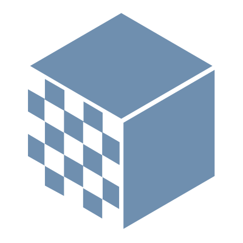

<p align="center">
  
</p>

<h1 align="center">Visualizador de la Suma de Minkowski</h1>

<h5 align="center">
  <em><code>Trabajo de Fin de Grado en Ingeniería Informática</code></em>
</h5>

<p align="center">
  
  
</p>

<p align="center" style="margin: 2px 0;">
  <strong>Universidad de Sevilla</strong>
</p>
<p align="center" style="margin: 2px 0;">
  <strong>Autor:</strong> Adriana Vento Conesa
</p>
<p align="center" style="margin: 2px 0;">
  <strong>Tutor:</strong> Antonio Jesús Cañete Martín
</p>

<h1></h1>

Este proyecto forma parte de un **Trabajo de Fin de Grado en Ingeniería Informática**, cuyo objetivo principal es desarrollar una herramienta para la exploración de la **suma de Minkowski** entre figuras geométricas planas.

## Acceso al Despliegue

Puedes probar la aplicación desplegada aquí:  
🔗 [https://adrvencon-tfg.onrender.com/](https://adrvencon-tfg.onrender.com/)

## Tecnologías Utilizadas

- **Backend:** Python 3.12.6 con Flask.
- **Frontend:** HTML5, CSS3, JavaScript, Chart.js.
- **Documentación:** LaTeX (memoria del TFG).

## Ejecución Local

> Requisitos previos:
> - Python 3.9+ instalado en el sistema  
> - pip (gestor de paquetes de Python)

#### 1. Clona el repositorio

```bash
git clone https://github.com/adrvencon/tfg.git
cd tfg
```

#### 2. Crea un entorno virtual (opcional, pero recomendado)

```bash
python -m venv venv
source venv/bin/activate    # En Linux/Mac
venv\Scripts\activate       # En Windows
```

#### 3. Instala las dependencias

```bash
pip install -r requirements.txt
```

#### 4. Ejecuta la aplicación

```bash
python run.py
```

La aplicación estará disponible en `http://127.0.0.1:5000` por defecto.

